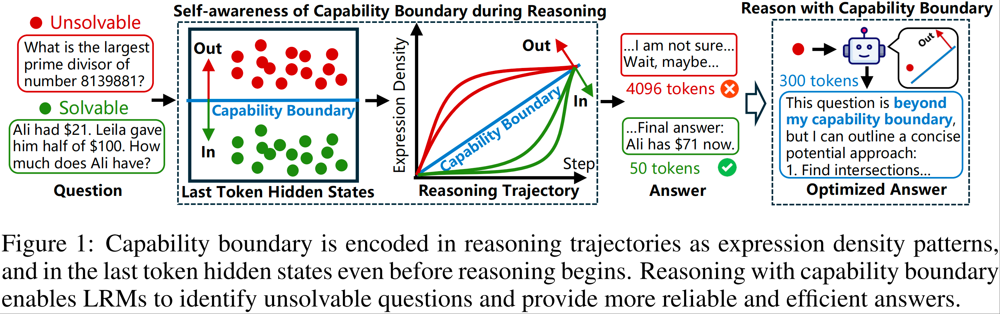

# Stop Before You Fail: Operational Capability Boundaries for Mitigating Unproductive Reasoning in Large Reasoning Models

This is the code repository of our work: On the Self-awareness of Large Reasoning Models' Capability Boundaries

This repository contains the code to:
1. Extract last token hidden states for input questions.
2. Classify hidden states of solvable and unsolvable questions, and plot capability boundaries.
3. Optimize reasoning with self-awareness prompt suffix and output prefix.

## Abstract
Current answering paradigms for Large Reasoning Models (LRMs) often fail to account for the fact that some questions may lie beyond the model’s operational capability boundary, leading to long but unproductive reasoning. In this paper, we study whether LRMs expose early signals predictive of such cases, and whether these signals can be used to mitigate unproductive reasoning. In black-box settings, we find that reasoning expressions contain failure-predictive signals. In white-box settings, we show that the hidden states of the last input token contain information that is predictive of whether a question will not be solved correctly under our evaluation setup. Building on these observations, we propose two test-time monitoring strategies: reasoning expression monitoring and hidden states monitoring, that reduce token usage by 62.7–93.6%, substantially improving efficiency and reliability while largely preserving accuracy.

<p align="center">
  
</p>

## Setup

### Environment setup
1. Create a new conda environment:
```bash
conda create -n CB python=3.10 -y  # Python >= 3.10 required
conda activate CB
```

2. Install dependencies:
```bash
pip install -r requirements.txt
```

## 1. Extract last token hidden states

Follow `./code/extract_hidden_LRM.sh` and `./code/extract_hidden_LRM.py` to extract last token hidden states for LRMs on input questions.

Please first put the inference results in  `./data/inference`.

We provide an example of **gpt-oss-20b** in `./data/inference/aime24/gpt-oss-20b`.

## 2. Classify hidden states and plot capability boundaries

Follow `./code/capabilityBoundary.sh` and `./code/capabilityBoundary.py` to classify hidden states of solvable and unsolvable questions, and plot capability boundaries.

We provide an example of **gpt-oss-20b** in `./data/capabilityBoundaries/gpt-oss-20b`.

## 3. Optimize reasoning

Follow `./code/optimize.sh` and `./code/optimize.py` to optimize reasoning with self-awareness prompt suffix and output prefix.

We provide an example of **gpt-oss-20b** in `./data/optimize`.
